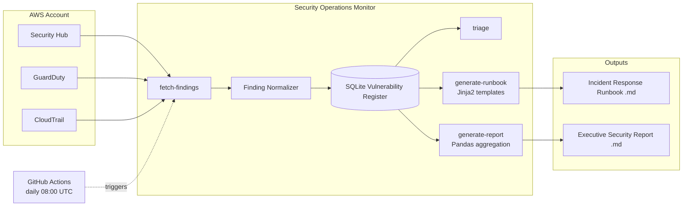

# AWS Security Operations Monitor with Automated Vulnerability Register

A Python CLI that pulls findings from AWS Security Hub, maintains a structured vulnerability register, auto-generates incident response runbooks, and produces executive-ready security reports — with compliance mapping to OSFI B-13, OWASP, and CIS.


---

## Table of Contents

- [Problem Statement](#problem-statement)
- [Architecture](#architecture)
- [AWS Security Hub](#aws-security-hub)
- [The Vulnerability Register](#the-vulnerability-register)
- [Automated Runbook Generation](#automated-runbook-generation)
- [Sample Output](#sample-output)
- [Compliance Mapping](#compliance-mapping)
- [OSFI B-13 and Why It Matters Here](#osfi-b-13-and-why-it-matters-here)
- [Setup](#setup)
- [CLI Reference](#cli-reference)
- [Future Improvements](#future-improvements)
- [License](#license)

---

## Problem Statement

Financial institutions run hundreds of AWS accounts and services, and cloud security tooling like Security Hub and GuardDuty routinely surfaces dozens of findings a day. Two things tend to go wrong in practice:

1. **Findings pile up faster than they get triaged.** Without a structured register, there's no single source of truth for what's open, how long it's been open, who owns it, and whether it's been formally accepted as risk versus simply forgotten.
2. **Incident response is inconsistent.** The quality of the response to "we found a public S3 bucket" depends heavily on which analyst is on call and whether they remember every containment step. That's an unacceptable amount of variance in a regulated environment.

This tool addresses both: it turns raw Security Hub findings into a durable, auditable register with age and ownership tracking, and it turns "we found finding X" into a consistent, reviewable incident response runbook — every time, for every analyst, regardless of experience level. That consistency and auditability is exactly what regulators like OSFI expect to see evidenced in a technology risk management program.

## Architecture



**Design decisions worth calling out:**

- **All AWS API calls are isolated to one module** (`src/security_hub_client.py`). Everything downstream operates only on the normalized `Finding` dataclass, so the mock data generator is a drop-in replacement for real AWS calls — the rest of the pipeline can't tell the difference.
- **The register is the system of record, not Security Hub.** Security Hub only shows current state; once a finding stops being reported as active, we mark it `resolved` in the register rather than losing history, because an auditor asking "show me every finding open in the last 12 months" needs a persistent record.
- **Compliance mapping is a static, version-controlled table** (`src/models.py::COMPLIANCE_MAP`), not something inferred at runtime. Mapping a finding type to a control is a governance decision that should be reviewed and diffed in pull requests like any other risk artifact — not silently derived by a heuristic.

## AWS Security Hub

AWS Security Hub is a cloud security posture management (CSPM) service that aggregates, deduplicates, and prioritizes security findings from multiple sources: its own automated security checks (based on standards like the CIS AWS Foundations Benchmark), GuardDuty threat findings, Inspector vulnerability scans, IAM Access Analyzer, and third-party tools. Each finding follows the AWS Security Finding Format (ASFF) — a consistent schema with severity, resource, description, and remediation fields — regardless of which underlying service generated it.

For a financial institution, Security Hub matters for two related reasons. First, it's an operational tool: it gives the security team one place to see posture drift across every account in the organization instead of checking a dozen dashboards. Second, it's a **compliance artifact**: Security Hub's standards packs map directly to control frameworks (CIS, NIST, PCI-DSS) that examiners and auditors ask about directly, and the finding history itself is evidence that the institution has continuous monitoring in place — a specific expectation under frameworks like OSFI B-13 (see below).

## The Vulnerability Register

A vulnerability (or risk) register is a structured, ongoing record of identified security weaknesses: what they are, how severe they are, who owns fixing them, and what's actually being done. It's a foundational artifact in any mature risk management program, and financial institutions are typically required to maintain one, in some form, to demonstrate that identified technology risks are being tracked and actively managed rather than just discovered and forgotten.

Raw Security Hub findings aren't a register on their own — they only reflect *current* state, they don't track ownership or remediation notes, and once a misconfiguration is fixed the finding simply disappears with no record it ever happened. This tool closes that gap: `update-register` diffs each fetch against the SQLite database, inserting new findings, updating ones still active, and formally transitioning findings to `resolved` when Security Hub stops reporting them — with every state transition logged in a `register_events` audit table.

### Schema

| Field | Purpose |
|---|---|
| `finding_id`, `title`, `description`, `severity` | Core finding identity, sourced from Security Hub/GuardDuty |
| `resource_id`, `resource_type`, `account_id`, `region` | Where the risk lives |
| `detected_at`, `last_seen_at` | First/most-recent observation, used to compute age and SLA breaches |
| `status` | `open`, `in remediation`, `resolved`, or `accepted risk` |
| `assigned_owner`, `remediation_notes`, `resolution_date` | Ownership and audit trail |
| `compliance_mapping` | JSON blob of OWASP / CIS / NIST / OSFI B-13 controls this finding maps to |
| `reviewed` | Whether an analyst has triaged this finding yet |

## Automated Runbook Generation

`generate-runbook <finding_id>` renders a Jinja2 template into a complete, structured Markdown incident response runbook, selected automatically based on the finding's normalized type. Six finding types have dedicated templates — **exposed credentials, public S3 buckets, permissive security groups, excessive IAM permissions, unencrypted data at rest, and CloudTrail logging failures** — covering the most common and highest-impact misconfiguration classes in AWS environments. Anything that doesn't match one of those six falls back to a generic template rather than failing outright.

Every runbook follows the same six-section structure: **Finding Summary, Immediate Containment, Root Cause Investigation, Remediation Procedure, Verification Steps, and a Lessons Learned template** left blank for the responding analyst to complete. That consistency is the point — it means incident quality doesn't depend on which analyst happens to be on call, and it gives a reviewer (or an examiner) a predictable structure to audit against.

## Sample Output

The samples below were generated by the actual code in this repository against the built-in mock data generator (`generate_mock_findings(count=18, seed=42)`), not hand-written.

### CLI: `triage`

```
                    Triage Queue (18 unreviewed findings)
┏━━━━━━━━━━┳━━━━━━━━━━━━┳━━━━━━━━━━━━━━━━━━━━━━━━━━━━━━━━━━━━━━━━━━┳━━━━━━━━━━━━━━━━━━━━━┳━━━━━━━━━━┳━━━━━━━━━━━┓
┃ ID       ┃ Severity   ┃ Title                                    ┃ Resource            ┃Days Open ┃Risk Score ┃
┡━━━━━━━━━━╇━━━━━━━━━━━━╇━━━━━━━━━━━━━━━━━━━━━━━━━━━━━━━━━━━━━━━━━━╇━━━━━━━━━━━━━━━━━━━━━╇━━━━━━━━━━╇━━━━━━━━━━━┩
│ 50eedf6c │ CRITICAL   │ IAM access key exposed in public GitHub │ AwsIamAccessKey     │    21    │    115    │
│ 7345bdd6 │ HIGH       │ CloudTrail logging is disabled or...    │ AwsCloudTrailTrail  │    45     │    69     │
│ 4e2e01d8 │ HIGH       │ Security group allows unrestricted...   │ AwsEc2SecurityGroup │    45     │    69     │
│ 6ad12854 │ MEDIUM     │ S3 bucket allows public read access     │ AwsS3Bucket         │    14     │    17     │
│ ...      │ ...        │ ...                                      │ ...                 │   ...     │   ...     │
└──────────┴────────────┴──────────────────────────────────────────┴─────────────────────┴──────────┴───────────┘

Risk score = severity weight x age factor.
Use `generate-runbook <finding_id>` to act on a finding.
```

### CLI: `update-register`

```
       Vulnerability Register Update
┏━━━━━━━━━━━━━━━━━━━━━━━━━━━━━━━━━━━━━━━━━┳━━━━━━━┓
┃ Action                                  ┃ Count ┃
┡━━━━━━━━━━━━━━━━━━━━━━━━━━━━━━━━━━━━━━━━━╇━━━━━━━┩
│ New findings inserted                   │ 18    │
│ Existing findings updated               │ 0     │
│ Findings auto-resolved (no longer active)│ 0     │
└──────────────────────────────────────────┴───────┘
```
*(actual counts as produced by running the real `upsert_findings` logic against the seeded mock dataset)*

### Generated Report — [full file](./sample_output/sample_report.md)

Excerpt (real output, this run had 2 CRITICAL / 8 HIGH / 8 MEDIUM open findings, 3 past SLA):

```
## SLA Aging Analysis

Findings are expected to be remediated within severity-based SLA windows
(CRITICAL: 7d, HIGH: 14d, MEDIUM: 30d, LOW: 60d, INFORMATIONAL: 90d).
3 finding(s) currently breach their SLA window.

| Finding                                                | Severity | Days Open | SLA (days) | Resource |
|---------------------------------------------------------|----------|-----------|------------|----------|
| CloudTrail logging is disabled or not delivering logs   | HIGH     | 45        | 14         | ...      |
| Security group allows unrestricted ingress on sensitive port | HIGH | 45        | 14         | ...      |
| IAM access key exposed in public GitHub repository       | CRITICAL | 21        | 7          | ...      |
```

### Generated Runbook — [full file](./sample_output/sample_runbook.md)

This is the actual runbook produced by `generate-runbook 50eedf6c-a691-4467-b4eb-b7bfa11aac0a` for a real CRITICAL finding in the mock dataset: an exposed IAM access key belonging to `prod-payments-api`, open 21 days.

```markdown
# Incident Response Runbook: Exposed AWS Credentials

**Runbook generated:** 2026-07-13T15:00:00Z
**Finding ID:** 50eedf6c-a691-4467-b4eb-b7bfa11aac0a
**Severity:** CRITICAL
**Status:** open

## 1. Finding Summary

- **Title:** IAM access key exposed in public GitHub repository
- **Description:** An active AWS access key belonging to prod-payments-api
  was found committed to a public source code repository...
- **Affected resource:** `arn:aws:awsiamaccesskey:::prod-payments-api-334` (AwsIamAccessKey)
- **Detected:** 2026-06-22T14:56:41 (21 days open)

## 2. Immediate Containment Steps

1. **Deactivate the exposed access key immediately** — do not wait for
   root-cause analysis to complete first:
   ```
   aws iam update-access-key --access-key-id <KEY_ID> --status Inactive --user-name <USER_NAME>
   ```
...
```
(See the full file for all six sections including remediation, verification, and the lessons-learned template.)

## Compliance Mapping

Every finding type in this tool maps to a static, version-controlled set of controls across four frameworks:

| Finding Type | OWASP | CIS AWS Foundations | NIST 800-53 / CSF |
|---|---|---|---|
| Exposed credentials | A07:2021 – Auth Failures | 1.12, 1.14 | IA-5, PR.AC-1 |
| Public S3 bucket | A01:2021 – Broken Access Control | 2.1.5 | AC-3, PR.AC-3 |
| Permissive security group | A05:2021 – Security Misconfiguration | 5.2, 5.3 | SC-7, PR.AC-5 |
| Excessive IAM permissions | A01:2021 – Broken Access Control | 1.16 | AC-6, PR.AC-4 |
| Unencrypted data at rest | A02:2021 – Cryptographic Failures | 2.1.1, 2.2.1 | SC-28, PR.DS-1 |
| CloudTrail logging failure | A09:2021 – Logging Failures | 3.1 | AU-2, DE.AE-3 |

Every finding also carries an **OSFI B-13** domain mapping (see `src/models.py::COMPLIANCE_MAP`), described below.

## OSFI B-13 and Why It Matters Here

**OSFI (the Office of the Superintendent of Financial Institutions)** is the federal regulator overseeing Canada's banks, insurers, and federally regulated trust and loan companies. **Guideline B-13 (Technology and Cyber Risk Management)**, in force since 2024, sets out OSFI's expectations for how these institutions govern technology risk — spanning technology risk governance, resilience, cyber security, third-party/cloud provider risk, data risk, and incident management.

A federally regulated Canadian financial institution, falls squarely under B-13. A few B-13 expectations this tool is built to directly evidence:

- **Continuous monitoring and timely identification of vulnerabilities** — `fetch-findings` running daily via GitHub Actions, feeding a persistent register.
- **A structured process for tracking and remediating identified risks** — the vulnerability register itself, with status, ownership, and audit-logged state transitions.
- **Documented, repeatable incident response procedures** — the runbook generator, which ensures a consistent response regardless of which analyst is on call.
- **Reporting to management/oversight bodies on the current risk posture** — `generate-report`, producing an executive-ready summary with SLA aging, suitable for a risk committee.

This tool doesn't claim to make an institution B-13 compliant by itself — B-13 compliance is a program-level outcome involving governance, policy, and people, not just tooling. What it demonstrates is an engineering approach that is *aware* of what a regulator in this space actually expects to see evidenced, and builds tooling that produces that evidence as a natural byproduct of doing the work, rather than as a separate reporting exercise bolted on afterward.

## Setup

### Option A — Mock data (no AWS account required)

```bash
git clone https://github.com/jm5579/aws-security-ops-monitor.git
cd aws-security-ops-monitor
python3 -m venv .venv && source .venv/bin/activate
pip install -r requirements.txt
cp .env.example .env   # USE_MOCK_DATA=true by default

python -m src.cli fetch-findings
python -m src.cli update-register
python -m src.cli triage
python -m src.cli generate-report
python -m src.cli generate-runbook <finding_id_from_triage_output>
```

### Option B — Connecting to a real AWS Security Hub environment

1. **Enable Security Hub** in the target account/region (Console → Security Hub → Enable Security Hub, or `aws securityhub enable-security-hub`), and enable at least the CIS AWS Foundations standard.
2. **Create an IAM role or user with read-only Security Hub access**, minimally:
   ```json
   {
     "Version": "2012-10-17",
     "Statement": [
       {"Effect": "Allow", "Action": ["securityhub:GetFindings", "securityhub:BatchGetFindings"], "Resource": "*"}
     ]
   }
   ```
3. **Configure credentials** — locally via `aws configure --profile secops-monitor`, or in CI via GitHub's OIDC provider assuming an IAM role (see the commented-out step in `.github/workflows/daily-scan.yml`) rather than long-lived access keys.
4. **Update `.env`**:
   ```
   USE_MOCK_DATA=false
   AWS_REGION=ca-central-1
   AWS_PROFILE=secops-monitor
   ```
5. Run the same commands as Option A — `fetch-findings` will now call the real Security Hub API via `src/security_hub_client.py`.

## CLI Reference

| Command | Description |
|---|---|
| `fetch-findings` | Pull active findings from Security Hub (or mock data) into a local snapshot |
| `update-register` | Load the snapshot into the SQLite register; inserts new, updates existing, resolves stale findings |
| `triage` | Rich-formatted table of unreviewed findings, ranked by a severity/age risk score |
| `generate-runbook <finding_id>` | Render a Jinja2 incident response runbook for a specific finding |
| `generate-report` | Produce the executive Markdown security report (severity summary, SLA aging, resource breakdown) |

Run `python -m src.cli --help` or `python -m src.cli <command> --help` for full option details.

## Future Improvements

1. **Slack/Teams alerting** for new CRITICAL findings, rather than requiring someone to check the GitHub Actions summary.
2. **Multi-account support** via AWS Organizations' Security Hub aggregation, so one register covers the whole org rather than one account at a time.
3. **SOAR-style auto-remediation** for a curated subset of low-risk, high-confidence finding types (e.g. auto-revoking a clearly unintended 0.0.0.0/0 rule on a non-production security group), with a human-approval gate.
4. **Web dashboard** (e.g. a lightweight FastAPI + HTMX front end) as an alternative to the CLI for non-technical stakeholders reviewing the register.
5. **Ticketing system integration** (Jira/ServiceNow) so `update-register` can open/close tickets automatically instead of just updating SQLite.
6. **Historical trend analytics** — mean time to remediate by severity/team over time, to support the kind of quarter-over-quarter risk committee reporting a real security operations function needs.

## License

MIT — see [LICENSE](./LICENSE).
